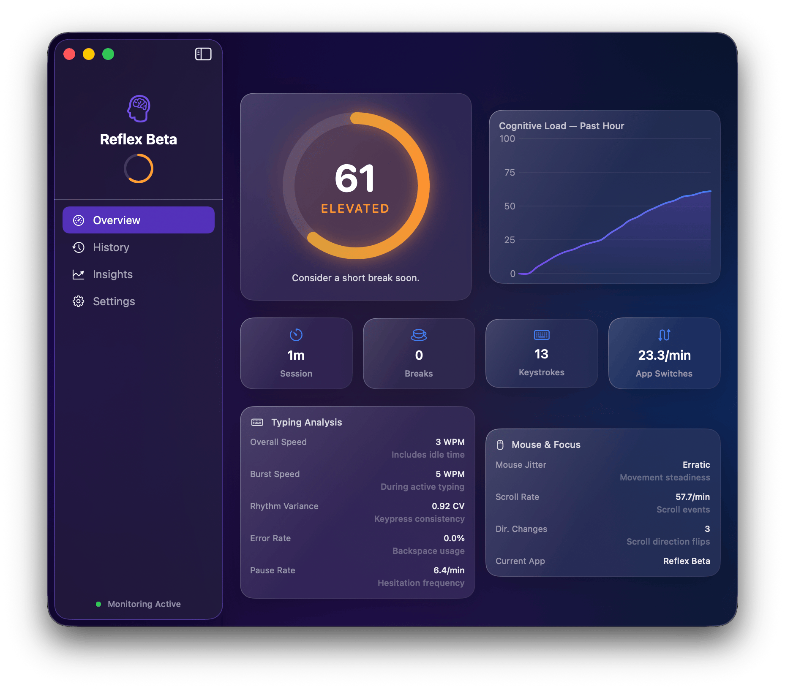
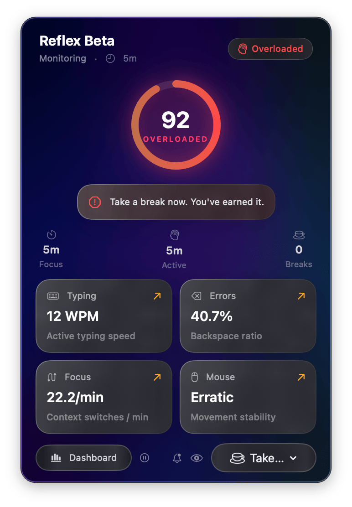
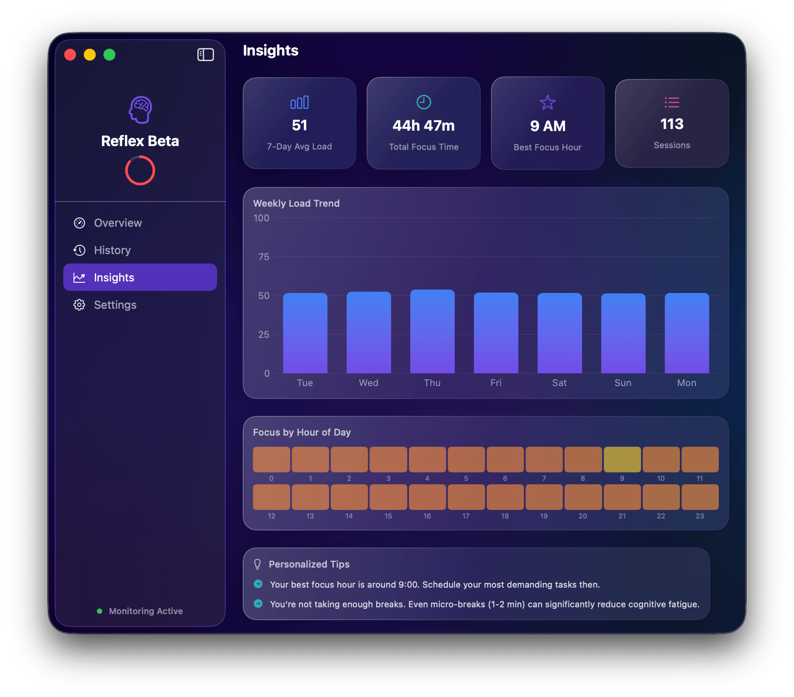
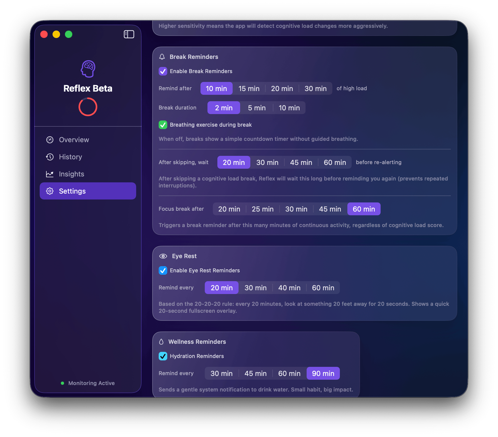

# Reflex Beta

### Website: https://reflexapp.pages.dev/

<p align="center">
    <b>Know when your brain needs a break.</b><br/>
    Native macOS cognitive load monitoring with smart break interventions.
</p>

<p align="center">
    <a href="https://reflexapp.pages.dev/"></a>
    <a href="https://github.com/KamalReddy2901/reflex-app/releases/latest"></a>
    
    
    
</p>

---

## Why Reflex

Reflex Beta is a menu bar app for macOS that estimates cognitive load in real time using behavioral signals from typing, mouse activity, app switching, and scroll dynamics.

It helps you intervene before burnout with staged break prompts, eye-rest reminders, and actionable trend insights.

## Quick Links

- Website: https://reflexapp.pages.dev/
- Latest DMG: https://github.com/KamalReddy2901/reflex-app/releases/latest
- Issues: https://github.com/KamalReddy2901/reflex-app/issues
- License: [MIT](LICENSE)

## Highlights

- Real-time 0-100 cognitive load score, updated every few seconds
- Personal baseline calibration (first ~15 minutes)
- Three break triggers: load-based, time-based, and eye-rest
- Guided break flow: cursor follower, popup, fullscreen overlay
- Fatigue-aware scoring for long uninterrupted sessions
- Natural break detection for idle periods
- Session history, weekly trends, and focus heatmaps
- Optional hydration reminders
- 100% local-first privacy model

## Product Snapshots

| Dashboard | Menu Bar |
| --- | --- |
|  |  |

| Insights | Settings |
| --- | --- |
|  |  |

## How Scoring Works

Reflex combines weighted behavioral signals:

```text
Load Score = Typing Variance (25%)
                     + Error Rate (20%)
                     + Context Switches (20%)
                     + Mouse Jitter (15%)
                     + Pause Frequency (10%)
                     + Scroll Chaos (10%)
                     + Fatigue Factor (up to +25 after extended focus)
```

Signals are smoothed using EMA and normalized to your personal baseline.

## Smart Break System

1. Cognitive trigger: sustained elevated load in rolling windows
2. Time trigger: continuous work duration threshold
3. Eye-rest trigger: 20-20-20 inspired reminders

Intervention sequence:

1. Cursor-following countdown ring
2. Action popup (Start, Snooze, Skip)
3. Fullscreen break or eye-rest overlay

## Privacy by Design

- No keystroke content captured
- No screenshots captured
- No cloud dependency for core functionality
- No telemetry or analytics pipeline
- Data remains on-device at `~/Library/Application Support/Reflex/`

## Install (DMG)

1. Download the latest DMG from Releases
2. Drag Reflex Beta into Applications
3. First launch: right-click app, then Open
4. Approve Accessibility permission

Requirement: macOS 15.0+ (Sequoia or newer).

## Build From Source

```bash
brew install xcodegen
git clone https://github.com/KamalReddy2901/reflex-app.git
cd reflex-app
xcodegen generate
open Reflex.xcodeproj
```

Then run from Xcode with `Cmd+R`.

## Tech Stack

- Swift + SwiftUI
- AppKit integration for menu bar and overlays
- Accessibility APIs for input-event timing
- Local JSON persistence

## License

MIT License. See [LICENSE](LICENSE).

---

Built for people who forget to take breaks while doing deep work.
