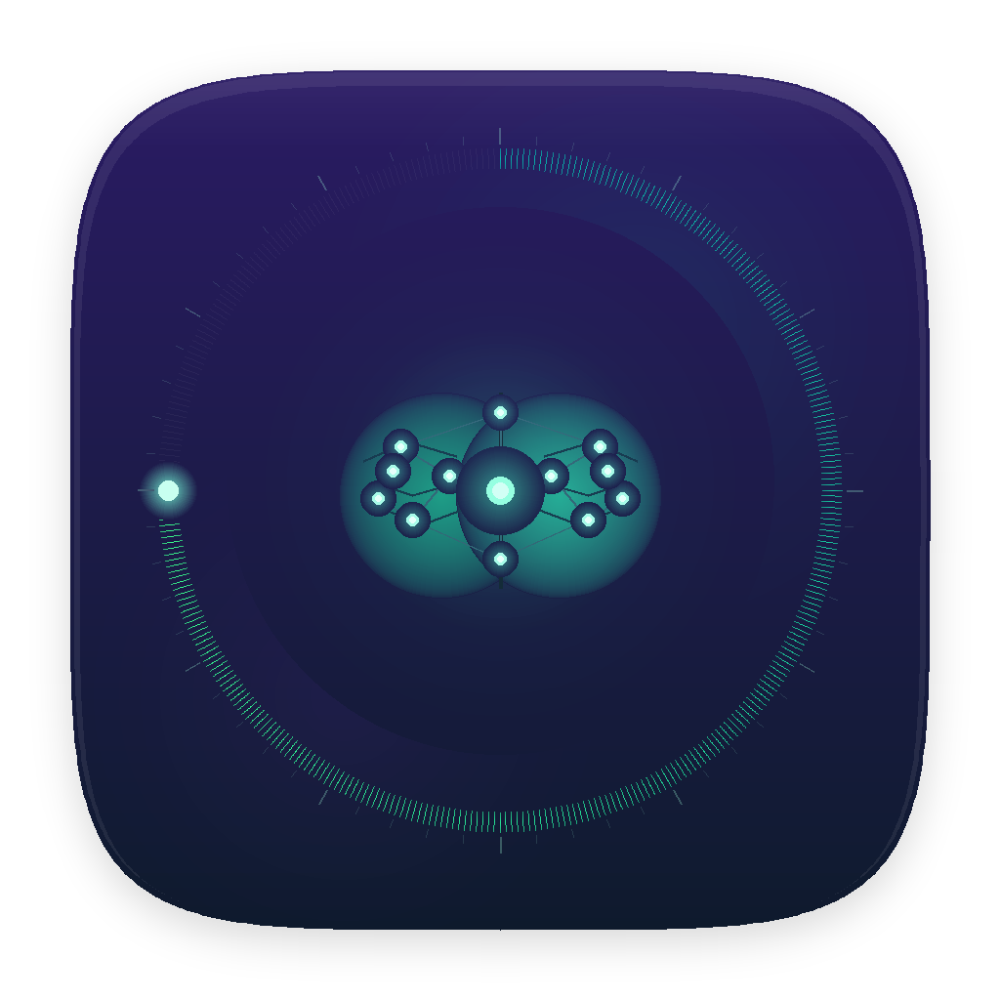

# Reflex Beta

## Website: https://reflexapp.pages.dev/

<p align="center">
    
</p>

<p align="center">
    <strong>Know when your brain needs a break.</strong><br/>
    Native macOS cognitive load monitoring with smart break interventions before burnout.
</p>

<p align="center">
    <a href="https://reflexapp.pages.dev/"></a>
    <a href="https://github.com/KamalReddy2901/reflex-app/releases/latest"></a>
    
    
    
</p>

<p align="center">
    <a href="https://reflexapp.pages.dev/"><strong>Live Website</strong></a> •
    <a href="https://github.com/KamalReddy2901/reflex-app/releases/latest"><strong>Download DMG</strong></a> •
    <a href="https://github.com/KamalReddy2901/reflex-app/issues"><strong>Report Issue</strong></a>
</p>

---

> [!IMPORTANT]
> **Release Spotlight**
>
> Grab the newest installer from: https://github.com/KamalReddy2901/reflex-app/releases/latest

## At a Glance

Reflex Beta is a menu bar app for macOS that estimates cognitive load in real time using behavioral patterns from typing rhythm, mouse dynamics, app switching, and scroll behavior.

It translates those signals into one clear score and uses staged, humane break interventions to protect focus and reduce fatigue.

## Feature Highlights

- Real-time 0-100 cognitive load scoring
- Personal baseline calibration (about 15 minutes)
- Three trigger system: load-based, time-based, eye-rest
- Guided break flow: cursor ring, popup, fullscreen overlay
- Fatigue-aware scoring for long uninterrupted sessions
- Automatic natural-break detection from idle time
- Session history, trend views, and focus heatmaps
- Optional hydration reminders
- Local-first privacy model with no cloud dependency

## Product Preview

| Dashboard | Menu Bar |
| --- | --- |
|  |  |

| Insights | Settings |
| --- | --- |
|  |  |

## Scoring Model

Reflex combines weighted behavioral signals:

```text
Load Score = Typing Variance (25%)
                     + Error Rate (20%)
                     + Context Switches (20%)
                     + Mouse Jitter (15%)
                     + Pause Frequency (10%)
                     + Scroll Chaos (10%)
                     + Fatigue Factor (up to +25 after extended focus)
```

Signals are smoothed with EMA and normalized against your personal baseline.

## Break Intelligence

1. Cognitive trigger: sustained elevated load in rolling windows
2. Time trigger: continuous work duration threshold
3. Eye-rest trigger: 20-20-20 inspired reminders

Intervention sequence:

1. Cursor-following countdown ring
2. Action popup with Start, Snooze, Skip
3. Fullscreen break or eye-rest overlay

## Privacy By Design

- No keystroke content capture
- No screenshots or screen recording
- No analytics or telemetry pipeline
- No required internet service for core operation
- Data remains on-device at `~/Library/Application Support/Reflex/`

## Install (DMG)

1. Download the latest DMG from Releases
2. Drag Reflex Beta into Applications
3. First launch: right-click app, then Open
4. Approve Accessibility permission

Requirement: macOS 15.0+ (Sequoia or newer).

## Build From Source

```bash
brew install xcodegen
git clone https://github.com/KamalReddy2901/reflex-app.git
cd reflex-app
xcodegen generate
open Reflex.xcodeproj
```

Run from Xcode with `Cmd+R`.

## Tech Stack

- Swift + SwiftUI
- AppKit for menu bar and overlay windows
- Accessibility APIs for event timing signals
- Local JSON persistence

## License

MIT License. See [LICENSE](LICENSE).

---

Built for people who forget to take breaks while doing deep work.
